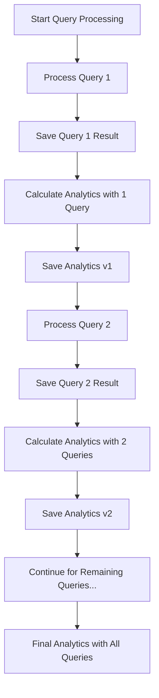

# Incremental Brand Analytics Implementation

## Overview

The brand analytics system has been updated to provide **real-time incremental updates** during query processing. Instead of waiting for all queries to be processed before calculating analytics, the system now calculates and saves analytics after each individual query is completed.

## Key Changes Made

### 1. Modified ProcessQueriesButton.tsx

**Location**: `src/components/features/ProcessQueriesButton.tsx`

**Changes**:
- **Added incremental analytics calculation** after each query is processed (lines 348-371)
- **Removed duplicate analytics calculation** that previously occurred only after all queries were completed
- **Real-time analytics updates** now happen during the processing loop

**New Flow**:
```
For each query:
1. Process query with AI providers
2. Save query result to Firestore
3. Calculate analytics with all results processed so far ← NEW
4. Save updated analytics to Firestore ← NEW
5. Continue to next query
```

### 2. Analytics Calculation Function

**Location**: `src/firebase/firestore/brandAnalytics.ts`

**Function**: `calculateCumulativeAnalytics()`

**Compatibility**: ✅ Already works perfectly with partial results
- Processes whatever query results are passed to it
- Calculates cumulative metrics based on available data
- Works with 1 query, 5 queries, or any number of results

## User Experience Improvements

### Before (Batch Analytics)
- ❌ User had to wait for ALL queries to complete
- ❌ No analytics shown until the very end
- ❌ If processing failed midway, no analytics were saved
- ❌ No real-time feedback on analytics progress

### After (Incremental Analytics)
- ✅ Analytics update after EACH query is processed
- ✅ Real-time analytics feedback during processing
- ✅ Partial analytics saved even if processing is interrupted
- ✅ Immediate insights as data becomes available

## Technical Implementation Details

### Processing Flow



### Code Changes

#### 1. Added Incremental Analytics Block
```typescript
// Calculate and save incremental analytics after each query
try {
  setMessage(`Updating analytics for ${brandName}...`);
  
  const analyticsData = calculateCumulativeAnalytics(
    targetBrand.userId,
    targetBrandId!,
    targetBrand.companyName,
    targetBrand.domain,
    processingSessionId,
    processingSessionTimestamp,
    allResults // Use all results processed so far
  );
  
  const { success: analyticsSaveSuccess, error: analyticsSaveError } = await saveBrandAnalytics(analyticsData);
  
  if (analyticsSaveSuccess) {
    console.log(`✅ Incremental analytics saved after query ${processedCount}:`, {
      totalBrandMentions: analyticsData.totalBrandMentions,
      brandVisibilityScore: analyticsData.brandVisibilityScore,
      totalCitations: analyticsData.totalCitations,
      topPerformingProvider: analyticsData.insights.topPerformingProvider
    });
  } else {
    console.error('❌ Error saving incremental analytics:', analyticsSaveError);
  }
} catch (analyticsError) {
  console.error('❌ Error calculating/saving incremental analytics:', analyticsError);
  // Don't fail the entire process for analytics errors
}
```

#### 2. Removed Duplicate Final Analytics
```typescript
// OLD CODE (REMOVED):
// Calculate and save cumulative analytics if processing was successful
// if (!cancelledRef.current && allResults.length > 0 && targetBrand) { ... }

// NEW CODE:
// Analytics are now calculated and saved incrementally after each query
// No need for final analytics calculation since it's done per query
```

## Analytics Data Structure

Each incremental update contains:

```typescript
{
  totalBrandMentions: number,        // Cumulative across processed queries
  brandVisibilityScore: number,      // Percentage of providers with mentions
  totalCitations: number,            // Total citations found
  totalDomainCitations: number,      // Citations to brand domain
  totalQueriesProcessed: number,     // Number of queries processed so far
  providerStats: {                   // Per-provider statistics
    chatgpt: { queriesProcessed, brandMentions, citations, ... },
    google: { queriesProcessed, brandMentions, citations, ... },
    perplexity: { queriesProcessed, brandMentions, citations, ... }
  },
  insights: {
    topPerformingProvider: string,
    averageBrandMentionsPerQuery: number,
    averageCitationsPerQuery: number,
    ...
  }
}
```

## Benefits

### 1. Real-Time Feedback
- Users see analytics building up as queries are processed
- Immediate insights into brand performance
- Progress indication beyond just "X of Y queries processed"

### 2. Fault Tolerance
- If processing stops midway, partial analytics are preserved
- No loss of analytical insights for completed queries
- Can resume processing with existing analytics as baseline

### 3. Better UX
- More engaging processing experience
- Users can see value being generated in real-time
- Reduces perceived waiting time

### 4. Debugging & Monitoring
- Easier to track which queries contribute most to brand mentions
- Real-time logging of analytics progression
- Better error isolation per query

## Testing Instructions

### 1. Process Queries
1. Go to `/dashboard/queries`
2. Click "Process Queries" 
3. Watch console logs for incremental analytics updates

### 2. View Real-Time Analytics
1. Open `/dashboard/analytics` in another tab
2. Refresh during processing to see updates
3. Or use `/dashboard/test-brand-analytics` for detailed view

### 3. Expected Console Output
```
✅ Incremental analytics saved after query 1: {
  totalBrandMentions: 3,
  brandVisibilityScore: 66.67,
  totalCitations: 8,
  topPerformingProvider: "chatgpt"
}
✅ Incremental analytics saved after query 2: {
  totalBrandMentions: 7,
  brandVisibilityScore: 83.33,
  totalCitations: 15,
  topPerformingProvider: "perplexity"
}
```

## Error Handling

- Analytics errors don't stop query processing
- Graceful fallback if analytics calculation fails
- Detailed error logging for debugging
- Processing continues even if analytics save fails

## Future Enhancements

1. **Real-Time UI Updates**: WebSocket or polling to update analytics UI during processing
2. **Progressive Analytics Charts**: Show charts building up in real-time
3. **Query-Level Analytics**: Individual analytics per query for comparison
4. **Trend Analysis**: Compare incremental analytics to detect patterns

## Conclusion

This implementation provides a much better user experience by showing analytics progress in real-time, ensuring no data loss if processing is interrupted, and giving users immediate insights as their queries are processed. The system maintains the same data accuracy while providing incremental updates that make the processing experience more engaging and informative. 