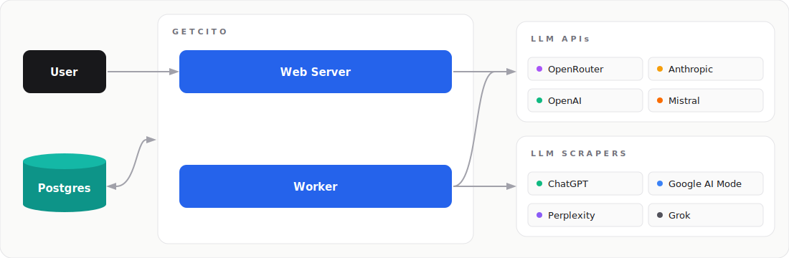

<p align="center">
  <a href="https://github.com/ai-search-guru/getcito-worlds-first-open-source-aio-aeo-or-geo-tool">
    
  </a>
</p>

<p align="center">
  Open source AI visibility tracking and optimization.
  <br />
  <br />
  <a href="https://www.getcito.com/"><strong>Learn more »</strong></a>
</p>

<br />

<p align="center">
  <a href="https://dashboard.getcito.com"></a>&nbsp;
  <a href="https://github.com/ai-search-guru/getcito-worlds-first-open-source-aio-aeo-or-geo-tool/issues"></a>&nbsp;
</p>

<br />

## About

Getcito is an open-source, self-hosted platform for optimizing your AI visibility, which is also known as:
* Answer Engine Optimization (AEO)
* Generative Engine Optimization (GEO)
* LLM Optimization (LLMO)

Getcito tracks how AI answer engines like ChatGPT, Claude, Perplexity, Gemini, and Google AI Overviews mention, cite, and describe your brand, so you can benchmark competitors and grow your visibility in AI answers.

It's a free alternative to tools like [Profound](https://www.getcito.com/ai-visibility-tools/profound), [Peec](https://www.getcito.com/ai-visibility-tools/peec-ai), and [Otterly](https://www.getcito.com/ai-visibility-tools/otterly-ai). You can run it on your own infrastructure, own your data, and audit exactly how every metric is calculated.

## Demo

Try the live demo at **[dashboard.getcito.com](https://dashboard.getcito.com)** to see how Getcito tracks prompts and analyzes citations.

## Quick Start

For local deployments, you can use Docker Compose to run Getcito directly:

```bash
# Clone the repository
git clone https://github.com/ai-search-guru/getcito-worlds-first-open-source-aio-aeo-or-geo-tool.git
cd getcito-worlds-first-open-source-aio-aeo-or-geo-tool

# Start the stack
docker compose -f docker-compose.whitelabel.yml up -d
```

> [!TIP]
> **Watch** this repo's **releases** to get notified of major updates.

## Architecture

<p align="center">
  
</p>

## Tech Stack

- [Docker Compose](https://docs.docker.com/compose/)
- [PostgreSQL](https://www.postgresql.org/)
- [TypeScript](https://www.typescriptlang.org/)
- [TanStack Start](https://tanstack.com/start/latest)
- [pg-boss](https://github.com/timgit/pg-boss)

## Contact

<!-- - [Discord](https://discord.gg/s24nubCtKz) -->
- [Email](mailto:team@getcito.com)
- **Phone (India):** +91-96505-10773
- **Phone (US):** +1-623-223-7423

<!-- 
## Repo Activity


-->

